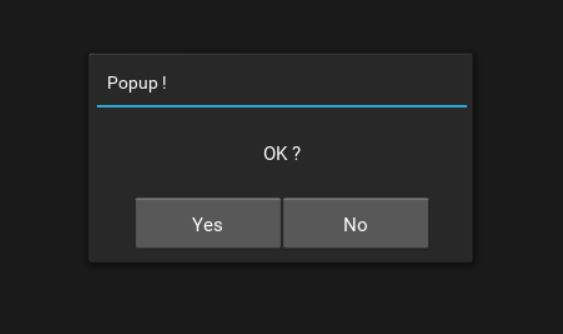

# Yes-No-Popup

a simple popup to ask us 'Yes or No ?'



# usage

class YesNoPopup inherits kivy.uix.popup.Popup class.
so you can use all keywords Popup class accepts.

YesNoPopup.message is an attribute for the string shown in center of popup. 

on_yes and on_no are events callback functions for 'Yes' and 'No' buttons.
you can set them by using bind(), like below.

```
def _popup_yes(instance):
    print('Yes !')

def _popup_no(instance):
    print('No !)

pop = YesNoPopup(
    title='Popup !',
    message='OK ?'
)
pop.bind(
    on_yes=_popup_yes,
    on_no=_popup_no
)

```

## License
MIT